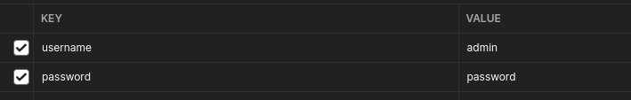

# miguel-pilotes-orders
Miguel Montoro's pilotes orders API, finally an easy and fast way to order the squisite meatball stew prepared but none other that the great Miguel Montoro using his family recipe of the classic majorcan dish!

## What it can do
The API exposes three resources.
- **Take**: As the name suggest it allows to order the great Miguel's pilotes
- **Update**: Maybe you just realize that 5 pilotes weren't enough, this will resolve this problem allowing you to modify the precedent request
- **search**: If you're an admin and are in need to search exactly how many pilotes has your friend Enrique ordered even tho he still owes you money

#### Common root path 
{{HOST}}/miguel-pilotes-orders/orders

### Take
**path** : /take

The take method takes in input two different objects.
A client with the information needed to identify how's making the request (such as name, surname, email ecc.) and a list of all the orders related to that path (we know one single order isn't enough!)

**Constraint:** The only constraint is the pilotes quantity for each order, that can be 5, 10 or 15

**All fields are mandatory and must be valid**

JSON INPUT EXAMPLE:
```json

{
  "client" : {
    "name":"Miguel",
    "surname": "Montoro",
    "telephoneNumber": "3280964336",
    "email":"elgranmiguel@pilotes.com"

  },
  "orders":[
    {
      "deliveryAddress":"Via montaditos 22",
      "pilotesQuantity":5

    },
    {
      "deliveryAddress":"Via montaditos 22",
      "pilotesQuantity":10

    },
    {
      "deliveryAddress":"Via montaditos 22",
      "pilotesQuantity":15

    }
  ]
}

```

The output will contain the status of the request and total of each order with the orderId  (this is important, it must be kept safe if you're in need to update the order if for example you decided to share the pilotes with you girlfriend and the delivery address must be modified)

JSON OUTPUT EXAMPLE:
```json

{
  "statusTakeOrderRequest": "3 orders were successfully inserted, you have 5 minutes, starting from now, 2022-12-22 08:11:04.099 to make any changes",
  "ordersInserted": [
    {
      "id": "ff8081818538abc6018538abd7a40000",
      "deliveryAddress": "Via montaditos 22",
      "pilotesQuantity": 5,
      "orderTotal": 6.65
    },
    {
      "id": "ff8081818538abc6018538abd7b50001",
      "deliveryAddress": "Via montaditos 22",
      "pilotesQuantity": 10,
      "orderTotal": 13.3
    },
    {
      "id": "ff8081818538abc6018538abd7b60002",
      "deliveryAddress": "Via montaditos 22",
      "pilotesQuantity": 15,
      "orderTotal": 19.95
    }
  ]
}

```

### Update
**path** : /update

To update as was mentioned before, it's crucial to have the specific order id that it's returned when inserting the order.
with it it's also important to define which field it's being change.
The options are:
- delivery address
- pilotes quantity
You can even change both at the same time!

**Constraint:** There is a time limit within which it's possible to update the order and that's five minutes, after that time it will be impossible because Miguel will be occupied cooking

**just the field idOrderToUpdate it's mandatory**

JSON INPUT EXAMPLE:

```json

{
  "idOrderToUpdate":"ff8081818538abc6018538abd7a40000",
  "orderDeliveryAddress": "Via cigogna 15",
  "pilotesQuantity": 15
}

```

The output will contain the status of the request and, if the number of pilotes has changed, also the new total order


JSON OUTPUT EXAMPLE: 

```json

{
  "statusOrderUpdateRequest": "The order with id ff8081818538c49e018538c4b50c0000 successfully updatedand the new order total price is set at 19.95"
}

```

### Search
**path** : /search

The search can be done using any field available of the client. It must be specified in the request the interested field and the value (even partial) you are searching for.
The options are:
- name
- surname
- telephoneNumber
- email

Only one field can be searched at a time

**Constraint:** Only admin users can use the search functionality, the username and password must be passed in the header.

They are defined by default in the application.properties as (if the enviroment variables are not found ):
- username = admin
- password = password

otherwise you can just set up the environment variables USERNAME_VALIDATION and PASSWORD_VALIDATION as you please and modify the request header accordingly 

**ALl fields are mandatory**

HEADERS EXAMPLE:



JSON INPUT EXAMPLE:

```json
{
  "fieldSearchingFor":"name",
  "valueToSearch":"Miguel"
}
```

The output will contain the list of all orders that can be associated with the requested info

JSON OUTPUT EXAMPLE:

```json
{
  "statusSearchOrderRequest": "The search was successfully completed",
  "listOrdersSearched": [
    {
      "id": "ff8081818538ed61018538ee148f0000",
      "deliveryAddress": "Via montaditos 22",
      "pilotesQuantity": 5,
      "orderTotal": 6.65
    },
    {
      "id": "ff8081818538ed61018538ee14a60001",
      "deliveryAddress": "Via montaditos 22",
      "pilotesQuantity": 10,
      "orderTotal": 13.3
    },
    {
      "id": "ff8081818538ed61018538ee14a80002",
      "deliveryAddress": "Via montaditos 22",
      "pilotesQuantity": 15,
      "orderTotal": 19.95
    }
  ]
}
```

### Conclusions
That was pretty much all you needed to know to start immediately using miguel-pilotes-orders API! What are you waiting for? you're an API request away from a succulent dish of pilotes!

### Bonus
Since you've read so far you've won the chance to see the master himself at work, here's a video of the great Miguel Montoro preparing Pilotes (with his mum), enjoy!
https://www.tokyvideo.com/video/recipe-of-pilotes-with-miquel-montoro


